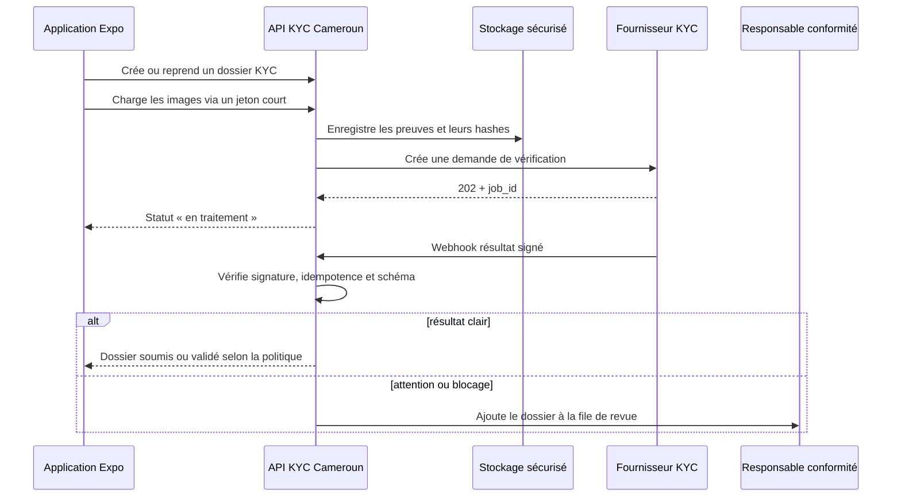
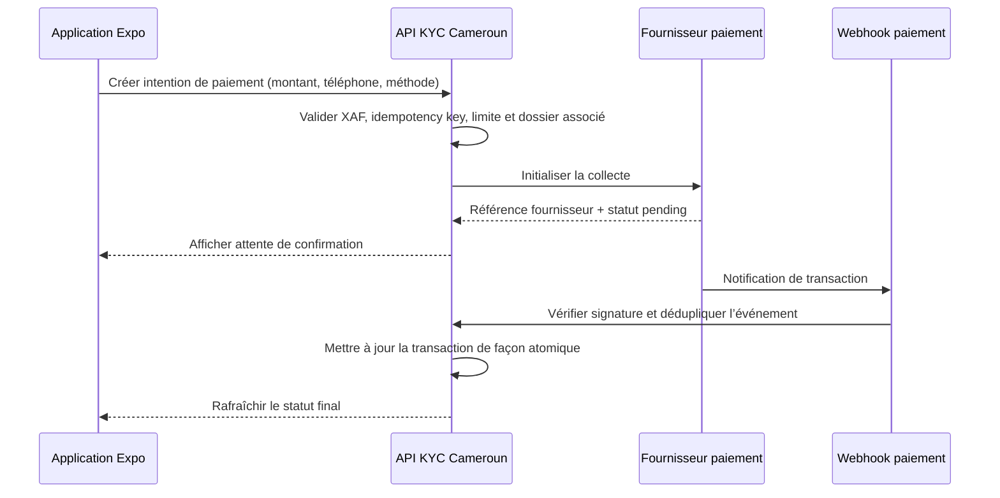

# Documentation technique — KYC Cameroun

## 1. Objet et statut du projet

KYC Cameroun est un **MVP Expo / React Native**, et non une application Flutter. Il démontre la gestion de dossiers KYC, la collecte guidée d’une pièce et d’un selfie, l’orientation par niveau de risque et la revue humaine. Le parcours actuel reste en mode démonstration : il ne transmet aucune pièce réelle à un fournisseur, ne valide pas une CNI contre une source gouvernementale et ne lance aucun paiement.

> **Principe de sécurité.** Une application mobile ne doit jamais embarquer les secrets d’un fournisseur KYC ou de paiement. Elle ne transmet que des jetons temporaires ou des requêtes applicatives au serveur, qui porte les identifiants de production, les appels tiers et la validation des webhooks.

## 2. Stack et structure

| Couche | Technologie | Responsabilité |
|---|---|---|
| Application mobile | Expo SDK 54, React Native, Expo Router, TypeScript | Écrans, capture guidée, états de parcours et affichage des décisions. |
| État local | React Context, AsyncStorage sur le web, Expo SecureStore sur appareil | Conservation locale de la démonstration et reprise de parcours. |
| API serveur | Node.js, Express, tRPC, Zod | Validation des entrées, orchestration KYC/paiement et contrôle d’accès. |
| Données | Drizzle ORM, base MySQL/TiDB du projet | Dossiers, événements, décisions, transactions et références de fournisseurs. |
| Fichiers | Stockage serveur compatible S3 | Pièces chiffrées côté fournisseur de stockage, accessibles par références et non par données brutes en base. |

Les fichiers principaux sont organisés comme suit :

```text
app/                    # Routes Expo Router et écrans mobiles
components/             # Composants de présentation et interactions
lib/kyc-store.tsx       # État local du MVP KYC
shared/kyc.ts           # Types métier et règles de statut/risque
server/routers.ts       # Procédures tRPC à étendre côté serveur
server/db.ts            # Requêtes et persistance à étendre
server/storage.ts       # Chargement des fichiers vers le stockage
drizzle/schema.ts       # Schéma de base de données à étendre
docs/                   # Installation, architecture et intégrations
```

## 3. Modèle métier cible

| Entité | Champs à conserver | Remarques de sécurité |
|---|---|---|
| `kyc_cases` | identifiant, statut, finalité, niveau de risque, référence client | Éviter de dupliquer inutilement les données de la pièce. |
| `kyc_evidence` | type, clé de stockage, hash, fournisseur, date d’expiration | Conserver une clé de stockage et un hash ; ne jamais journaliser l’image encodée. |
| `kyc_jobs` | fournisseur, identifiant de job, statut externe, payload normalisé | Permet de traiter les retours asynchrones et les reprises. |
| `kyc_decisions` | décision, auteur, justification, horodatage | La justification doit être obligatoire pour une décision humaine sensible. |
| `payment_transactions` | référence interne, fournisseur, montant XAF, téléphone masqué, statut, référence externe | La référence externe est unique et les transitions sont idempotentes. |
| `provider_events` | fournisseur, identifiant d’événement, type, hash, date de traitement | Protège contre les doublons de webhook et fournit une piste d’audit. |

## 4. Intégration de vérification de CNI camerounaise

### 4.1 Choix recommandé pour le premier adaptateur

Smile ID est un candidat approprié pour le premier adaptateur de vérification documentaire : sa page de couverture annonce la prise en charge de plusieurs catégories de documents camerounais, dont la CNI, et son produit **Document Verification** couvre l’authenticité du document, l’extraction des champs, la comparaison faciale et la détection de présence. [1] [2]

Cette vérification **n’est pas** équivalente à une interrogation directe d’une base de la DGSN. Si le produit exige une confirmation officielle du numéro de CNI contre une autorité émettrice, l’entreprise doit obtenir l’accord et le canal d’accès appropriés auprès de l’autorité compétente ; cet accès ne doit jamais être déduit d’une simple capacité OCR ou de détection de fraude.

### 4.2 Flux asynchrone à implémenter



Smile ID documente un appel REST asynchrone vers `POST /v3/document_verification`, qui retourne une réponse `202 Accepted` avec une référence de job puis appelle une URL de callback lorsque le traitement est terminé. Les statuts normalisés documentés sont `clear`, `attention`, `block` et `error`. [2]

### 4.3 Contrat d’adaptateur recommandé

Le code de production doit isoler les spécificités fournisseur derrière une interface. Cette séparation permet de remplacer Smile ID, d’ajouter une intégration autorité émettrice ou de configurer un second fournisseur sans modifier les écrans Expo.

```ts
export type KycStartInput = {
  caseId: string;
  countryCode: "CM";
  documentType: "CNI" | "PASSPORT" | "RESIDENCE_PERMIT";
  documentStorageKey: string;
  selfieStorageKey: string;
  livenessStorageKeys: string[];
};

export interface KycProvider {
  startVerification(input: KycStartInput): Promise<{
    providerJobId: string;
    state: "processing";
  }>;
  verifyWebhook(headers: Headers, rawBody: string): Promise<{
    providerEventId: string;
    providerJobId: string;
    status: "clear" | "attention" | "block" | "error";
    reason?: string;
  }>;
}
```

La procédure tRPC `kyc.startVerification` doit effectuer les contrôles suivants : vérifier le rôle de l’utilisateur, limiter le nombre de tentatives, valider le format des références de fichiers, créer un enregistrement de job local, appeler le fournisseur côté serveur et ne renvoyer à l’application que le statut et la référence interne nécessaires.

## 5. Intégration Mobile Money

### 5.1 Deux stratégies possibles

| Stratégie | Quand la choisir | Avantages | Contraintes |
|---|---|---|---|
| Adaptateurs directs MTN MoMo + Orange Money | L’entreprise possède ou peut obtenir un contrat direct avec chaque opérateur. | Contrôle fin et dépendance réduite à un agrégateur. | Deux onboarding, deux contrats de webhook, deux modèles opérationnels. |
| Agrégateur CinetPay | L’objectif est d’accélérer l’encaissement multi-moyens au Cameroun. | Une intégration de checkout ou API Direct, suivi de statut et webhooks ; l’offre indique le Cameroun parmi ses pays couverts. [3] [4] | Éligibilité marchande, disponibilité des moyens et conditions contractuelles à confirmer avant production. |

MTN présente officiellement ses produits Collection, Disbursement, Collection Widget et Remittances. Le portail cite notamment le flux de collection `RequestToPay`, la consultation du statut et la vérification de l’utilisateur. [5] Orange présente également un produit officiel Orange Money Web Payment / M Payment, avec un parcours d’application marchand. [6]

### 5.2 Flux d’encaissement à mettre en œuvre



Le téléphone mobile et le montant ne suffisent jamais à marquer un paiement comme réussi. L’état final doit provenir d’un webhook authentifié ou d’une vérification active auprès du fournisseur, puis être appliqué une seule fois grâce à une clé d’idempotence.

### 5.3 Contrat d’adaptateur recommandé

```ts
export type PaymentStartInput = {
  transactionId: string;
  amountXaf: number;
  payerMsisdn: string;
  method: "MTN_MOMO" | "ORANGE_MONEY" | "CINETPAY";
  callbackUrl: string;
};

export interface PaymentProvider {
  requestPayment(input: PaymentStartInput): Promise<{
    providerReference: string;
    status: "pending";
  }>;
  verifyWebhook(headers: Headers, rawBody: string): Promise<{
    providerEventId: string;
    providerReference: string;
    status: "succeeded" | "failed" | "cancelled" | "expired";
  }>;
}
```

L’API doit refuser un montant non entier ou inférieur à un seuil métier, normaliser le numéro en format international `+237`, masquer ce numéro dans les journaux, imposer une référence interne unique et journaliser séparément les événements fournisseur. Aucun endpoint mobile ne doit accepter un statut `succeeded` proposé par le client.

## 6. Configuration serveur attendue

Les variables suivantes sont volontairement **non renseignées** dans ce dépôt. Ajoutez-les exclusivement dans les secrets du serveur, jamais dans un préfixe `EXPO_PUBLIC_` ni dans le dépôt Git.

| Domaine | Variables proposées |
|---|---|
| Smile ID | `SMILE_ID_PARTNER_ID`, `SMILE_ID_API_KEY`, `SMILE_ID_CALLBACK_SECRET`, `SMILE_ID_BASE_URL` |
| MTN MoMo | `MTN_MOMO_SUBSCRIPTION_KEY`, `MTN_MOMO_API_USER`, `MTN_MOMO_API_KEY`, `MTN_MOMO_CALLBACK_URL`, `MTN_MOMO_ENVIRONMENT` |
| Orange Money | `ORANGE_MONEY_CLIENT_ID`, `ORANGE_MONEY_CLIENT_SECRET`, `ORANGE_MONEY_MERCHANT_KEY`, `ORANGE_MONEY_CALLBACK_URL` |
| CinetPay | `CINETPAY_SITE_ID`, `CINETPAY_API_KEY`, `CINETPAY_NOTIFY_URL`, `CINETPAY_RETURN_URL` |

Avant de renseigner un secret, créer les comptes sandbox, confirmer l’éligibilité de l’entité marchande, déclarer les URLs HTTPS de callback et demander les environnements de production aux partenaires choisis. Les noms de variable sont des conventions de projet ; il faut vérifier les noms, endpoints et signatures exacts dans la documentation actuelle de chaque fournisseur avant d’écrire l’adaptateur.

## 7. Sécurité, résilience et conformité

| Contrôle | Mise en œuvre attendue |
|---|---|
| Accès | Exiger une authentification et des rôles distincts pour l’agent, le responsable conformité et l’administrateur. |
| Données sensibles | Chiffrer les preuves au repos, utiliser des URLs courtes signées, restreindre l’accès par dossier et supprimer selon une durée de conservation validée. |
| Webhooks | Vérifier la signature, enregistrer l’ID d’événement, répondre rapidement, rejouer de manière contrôlée et traiter les doublons sans effet secondaire. |
| Décisions KYC | Faire remonter `attention`, `block` et les erreurs vers la revue humaine ; conserver la justification et l’auteur de toute décision. |
| Paiements | Ne jamais faire confiance au retour mobile ; confirmer côté serveur, utiliser l’idempotence et rapprocher les transactions `pending`. |
| Observabilité | Ne pas journaliser la CNI entière, les images, les secrets, les tokens ni le numéro complet de Mobile Money. |

## Références

[1]: https://smile.id/countries/cameroon "Smile ID — Identity verification in Cameroon"
[2]: https://docs.usesmileid.com/products/onboarding-with-biometrics/document-verification.md "Smile ID — Document Verification"
[3]: https://cinetpay.com/products/payments "CinetPay Collect"
[4]: https://cinetpay.com/products/api-direct "CinetPay API Direct"
[5]: https://momo.mtn.com/api/ "MTN MoMo API"
[6]: https://developer.orange.com/apis/om-webpay "Orange Money Web Payment / M Payment API"
